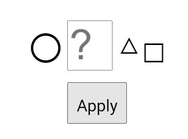

# 2023红包挑战题解

题目发布于 https://t.me/red_packets 。


故事起源于飞天（@FlyingSky7）往群里转了一条消息：

> 2023的新春紅包挑戰將在 @Red_Packets 進行，本次活動由 @Laoself 、 @Hexagram_Daily 和 @EFW_inno 聯合舉辦，題目類型比較多元，數量也較多，獎品還是支付寶拼手氣口令紅包，希望各位玩得盡興。
> 挑戰問題將從1.22 15:00 (UTC +8)開始發佈，每分鐘發佈一題，每一題對應一個口令紅包。參與挑戰者請按@Red_Packets_Bot 提示提交答案。在對應紅包過期前，為保證體驗，請勿轉傳或對外透露紅包口令。

看着题目不难且参与人数不多，就尝试着做了一道签到题……没想到入账20？！

**我不睡觉了！**

**我tm做爆！**

共9题，全部解出，共入账170，感恩各位老板。~~（新一代网赚项目）~~


## C1 Broken Keyboard

```
Jpnt, ukt h[''[rp,j Frphu ]y[jyd.A

p.][yu H[o,gdup[,
ho,b h_! ,A P,u+ 1Z P,u |
    ph , ?2 = | ytuoy, = Q
    frpubk , |
    bdft 3A ytuoy, 3
    bdft 4A ytuoy, 3
    gthdo'uA ytuoy, h_, 1 3+ @ h_, 1 4+
    Q
Q
]yp,u_h_37++

}'tdft fom.pu ukt ]yp,utg ytfo'uz
```

看起来像代码。考虑到题目名，应该是键盘翻转/移位之类的操作（常规加密方法了）。

突破口是单独占一行的 `Q`。这个位置通常出现是 `}`。

通过一番摸索，找到规律：键盘向左移2，首尾衔接，最左一列（`shift`、`~` 等）不受影响。

转码得到：

```swift
Given the following Swift program:

import Foundation
func f(_ n: Int) -> Int {
    if n <= 0 { return 0 }
    switch n {
        case 1: return 1
        case 2: return 1
        default: return f(n - 1) + f(n - 2)
    }
}
print(f(15))

Please submit the printed result.
```

没装编译器，直接扔在线工具，得到结果 `610`。

## C2 Circle Around

链接：https://spring-festival-red-envelope-2023.hexagr.am 。一个基于 WASM 的网页。



出题人给的提示是 `X`。输入进入下一步。


点击 `○`，出现一段十六进制字符：

> 4D 6A 51 32 4D 51 3D 3D
>
> 70c445ee64b1ed0583367a12a79a9ef2
>
> 4D 6A 52 43 51 51
>
> 4D 6A 52 43 51 67

直接上[cyberchef](https://gchq.github.io/CyberChef/)。

`4D 6A 51 32 4D 51 3D 3D` 先十六进制转字符，得 `MjQ2MQ==`，再 Base64 解码，得 `2461`；

`70c445ee64b1ed0583367a12a79a9ef2` 是md5，用CTF常用[小工具](https://www.somd5.com/)，得明文 `2464`；

`4D 6A 52 43 51 51` 和 `4D 6A 52 43 51 67` 同第一行，得 `24BA` 和 `24BB`。

根据提示 `U+`，转unicode，得 `②⑤ⒺⒻ`。而 `U+25EF` 又正好是 `◯`，所以答案是 `circle`。（？？？）

#### 后记

*最后一步太狗尾续貂了：*

- *并未限定答案的格式，直接提交 `◯` 也不无道理；*
- *`◯` 的名称是 large circle，只提交一半很奇怪；*
- *明明存在一个妙手 `◎`：`25EF` 本来就是带环的，最后理应得到一个双环。*

*感觉有点可惜了这么棒的idea。*

## C3 Frontend Master

签到题，没什么好说的，照着点就行了。


得到兑换码 `2023-happy-lunar-new-year-XD`。

## B2 xxxx

脑洞题，`○×△□` 代表索尼手柄。正好NS在电脑旁充电，按方位转换成 `ABXY`。提交后弹框：

> WoW，这都能想到！兑换码就是"xyab"，要注意大小写哦。

#### 后记

飞天直接 `F12` 翻 WASM 的源码，做出了非预期解法：

> 我斗胆猜 B2 解出来也会有三个字：兑换码（\e5\85\91\e6\8d\a2\e7\a0\81）
>
> （主要还是 C3 的兑换码直接能在 wat 里搜出来才想着可以直接翻 wat 的 data 部分的）


## C4 Letters from Olympians

> 勝利者以拉丁文刻下
> 斷取首級的符碼
> 從自然馴養穀物
> 共生小麥罌粟
> 最偉大英雄
> 亦無法將其守護
> 以后羿所長
> 射落神衹之物
> 三個符碼
> 大字筆下

提示是断章取义。

- 勝利者以拉丁文刻下：用拉丁字母表示；
- 斷取首級的符碼：取首字母；
- 從自然馴養穀物/共生小麥罌粟：Ceres？
- 最偉大英雄/亦無法將其守護： Heracles？
- 以后羿所長/射落神衹之物：Apollo？
- 三個符碼：三个字母；
- 大字筆下：大写。

试了好几次，得到答案 `CHA`。

这道题很迷，过于抽象，最后才试出来，一度准备爆破（也就26^3种，用字典筛一遍还更少）。payload 的构建方法后文有详细的介绍。

~~我希腊神话的知识储备都来源于 FGO~~

~~农神不应该长这样吗（~~


## C5 The Sound of Music

> 在 @EFW_inno 频道中上传的音乐中很多都来自于一个top 500美少女游戏音乐排行（见置顶3），问最早出现在频道中的一首曲目的编号是多少？（答案是三位数字的正整数）


鼠标放上去一个个看链接就好了。最早的是270：https://t.me/EFW_inno/388 。得到答案 `270`。

## C6 Wish Upon an Algorithm

> 话题建模模组tomotopy中基于Blei & Lafferty (2006)中的想法建立了某个模型，请问这个模型中形状参数c的初始设定值是多少？（答案是0~1之间的一个有理数）

搜索 `tomotopy`，找到文档：https://bab2min.github.io/tomotopy 。

页面中搜索 `Lafferty`，有两个结果，一个是 Correlated Topic Models，另一个是 Dynamic Topic Models。在 DTM 里看到一个参数 `lr_c=0.55`，提交 `0.55`，正确。

## B1 The Hard Way

> 不靠bot裡的web app，也不用修改Telegram客戶端，怎麼提交答案呢？
> 補充：
> 不用bot上的web app，但是要用bot。
> 本題提交方式不是那個提交按鈕。

之前有 telegram bot 的开发经验，这道题显得过于简单了。

web app 倒是第一次用，先查文档：https://core.telegram.org/bots/webapps 。

先研究 API。最重要的是 `sendData(data)`：

> A method used to send data to the bot. When this method is called, a service message is sent to the bot containing the data *data* of the length up to 4096 bytes, and the Web App is closed. See the field *web_app_data* in the class Message.

​	结合提交答案时一直提示的

> 您已成功将数据从"2023新春紅包挑戰"按钮传递到机器人。

就能明白 web app 是如何传递数据的：`textarea` 标签输入 -> 提交按钮封装 -> 发给 bot -> telegram 服务器 -> 后端通过 bot API 的 `update` 方法接收。

我们只要截取 web app 发送给 bot 的数据，再用常规输入框发送就能破题。

那如何截取呢？这个数据是对用户隐藏的。

[上文文尾](https://core.telegram.org/bots/webapps#debug-mode-for-web-apps)提到如何调试 web app：

> - Go to *Settings > Advanced > Experimental settings > Enable webview inspection*.
> - Right click in the WebView and choose *Inspect*.

打开 web app，进入控制台（当然 web 版的 telegram 可以直接跳过上一步）。

我们直接重写点击提交按钮时会调用的 `sendData()` 方法：

```javascript
window.Telegram.WebApp.sendData = function(e){console.log(e);};
```

web app 中提交第一题的答案，控制台输出 `e0affc69dcf64d40172d619f212625b56e21ec3aa6b81d6e730b8a62636313ff`。

复制到常规输入框中提交即可。

#### 后记

这道题也可以分析一下散列前的原文。

```javascript
window.loaction.href
```

输出 web app 的链接：

```
https://botweb.app/form?conf={"title":"2023春節紅包挑戰","content":[[{"field":"challenge","type":"picker","name":"挑戰題","options":[{"name":"C1 - Broken Keyboard","value":"broken-keyboard"},{"name":"C2 - Circle Around","value":"circle-around"},{"name":"C3 - Frontend Master","value":"frontend-master"},{"name":"C4 - Letters from Olympians","value":"letters-from-olympians"},{"name":"C5 - The Sound of Music","value":"the-sound-of-music"},{"name":"C6 - Wish Upon an Algorithm","value":"wish-upon-an-algorithm"},{"name":"B1 - The Hard Way","value":"the-hard-way"},{"name":"B2 - xxxx","value":"xxxx"},{"name":"B3 - Damage Calculator","value":"damage-calculator"}]}],[{"field":"answer","type":"textarea","name":"你的答案","placeholder":"My answer"}]],"submitBtnText":"提交","submitAs":"data","submitIn":"sha256"}
```

传输数据一般用 json，json 又一般按 key 的首字母排列，可以猜到原文为 `{"answer":"610","challenge":"broken-keyboard"}`，散列方式为 `SHA256`。测试发现正确。

#### 后记2

猜不到也有另一种方法：

先翻 js，搜索 `sendData`，有一段

```javascript
let i = JSON.stringify(s);
    if ((l == null ? void 0 : l.submitIn) == "sha256") {
      const u = new TextEncoder().encode(i),
        d = await crypto.subtle.digest("SHA-256", u);
      i = Array.from(new Uint8Array(d))
        .map((c) => c.toString(16).padStart(2, "0"))
        .join("");
    }
    switch (l == null ? void 0 : l.submitAs) {
      case "data":
      default:
        a.sendData(i);
    }
```

因此将 `"submitIn":"sha256"` 去掉就能得到明文。

控制台输入：

```javascript
window.loaction.href = 'https://botweb.app/form?conf={"title":"2023春節紅包挑戰","content":[[{"field":"challenge","type":"picker","name":"挑戰題","options":[{"name":"C1 - Broken Keyboard","value":"broken-keyboard"},{"name":"C2 - Circle Around","value":"circle-around"},{"name":"C3 - Frontend Master","value":"frontend-master"},{"name":"C4 - Letters from Olympians","value":"letters-from-olympians"},{"name":"C5 - The Sound of Music","value":"the-sound-of-music"},{"name":"C6 - Wish Upon an Algorithm","value":"wish-upon-an-algorithm"},{"name":"B1 - The Hard Way","value":"the-hard-way"},{"name":"B2 - xxxx","value":"xxxx"},{"name":"B3 - Damage Calculator","value":"damage-calculator"}]}],[{"field":"answer","type":"textarea","name":"你的答案","placeholder":"My answer"}]],"submitBtnText":"提交","submitAs":"data"}';
```

再用上法重写 `sendData()`，也可得到明文 `{"answer":"610","challenge":"broken-keyboard"}`。

## B3 Damage Calculator

> 假设Baldrsky v1.04的运行环境，在同一combo中主角操纵机首先进行了一次Imperial Strike的攻击，进而进行了一次LV3身体冲撞（Body Blow）的攻击,考虑到武器补正值，不考虑敌我积蓄热量和其他外界因素，问这次身体冲撞造成的伤害为多少？（答案是一个正整数）

搜索 `Baldrsky v1.04 伤害`，搜索结果第二项为伤害修正的贴文：https://tieba.baidu.com/p/2108832838 。


~~铁山靠（察觉）~~

也就是说，`Imperial Strike` 的起手攻击会影响 `Body Blow` 的伤害。二楼给出了修正值，为 `-20`，也就是会**提高**20% `Body Blow` 的伤害。

那么  `Body Blow` 的伤害是多少呢？

搜索结果第三项的视频（https://www.bilibili.com/video/BV1694y1m7yU），up 用3级的 `Body Blow` 起手，伤害为 `100`。


加上起手的 `-20` 的修正，答案为 `120`。

#### 后记

这篇帖子（https://tieba.baidu.com/p/693682032）的3楼：

> DIVE2补丁的一些明显的改变，虽然也有强化的武器，不过那些基本上都没大用就是了
> ·1.03开始，ブンディダガー伤害大幅低下（1.02以前这招基本上无视补正）
> ·1.03开始，最终boss战难度大幅降低
> ·1.04开始，マインナックル补正大幅上升，マインナックル无限连中敌人会强制跑掉
> ·1.04开始，キリングレイジ威力下降
> ·1.05开始，エクステンドアーム威力下降
> ·1.04开始，バッドパートナー导致友军机受伤害也为1/4的bug被修复（打VH不能再不管友军机了）

似乎没有影响题中两个招式的伤害，因此没有做过多的考虑。

#### 后记2

这个帖子（https://tieba.baidu.com/p/2570528194）的16楼也有用 `Body Blow` 起手的伤害图。在索引贴（https://tieba.baidu.com/p/2660486171）搜索 `身体打击【起手】`就能找到16楼。

#### 后记3

题干中`身体打击`写成`身体冲撞`，还用了一个半角逗号

> 怎么有人不验题的啊啊啊啊啊啊啊啊啊啊啊啊啊啊啊啊啊啊啊啊啊啊
>
> ​        ——飞天